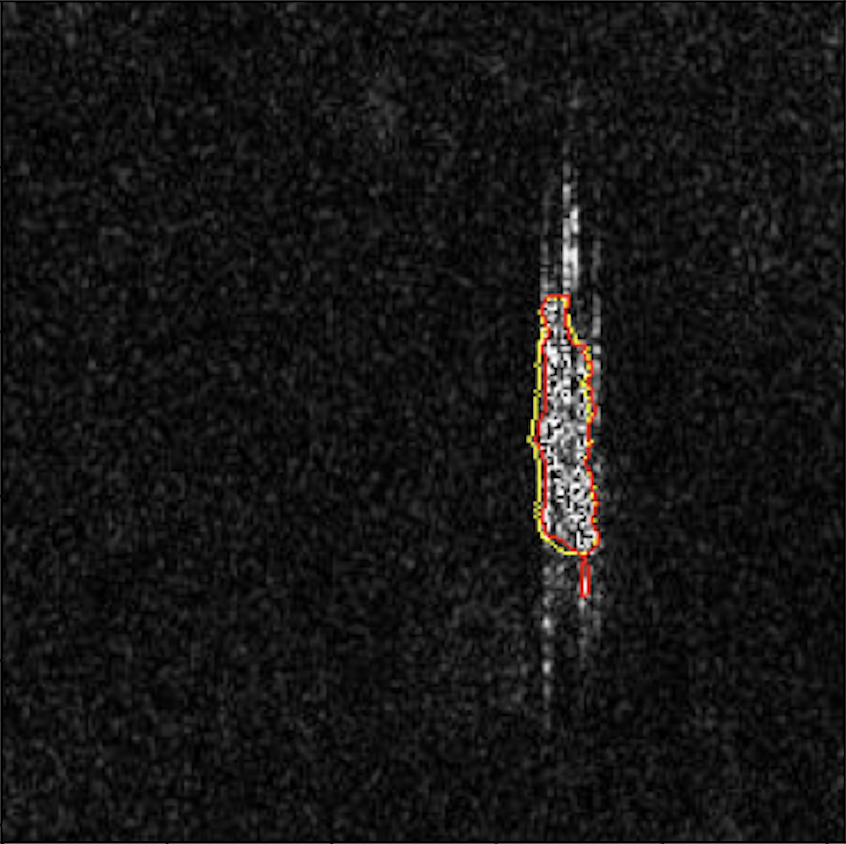
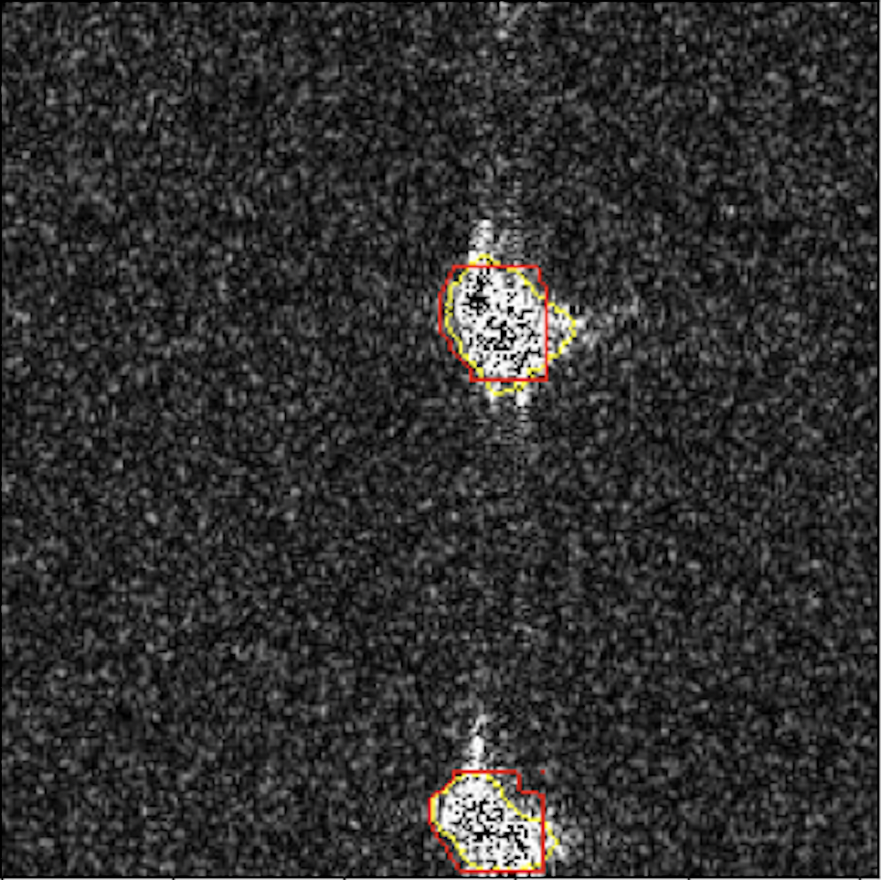

# Unsupervised deep learning methods for SAR ship detection
 
## Abstract
Recent advances in deep learning have substantially facilitated the development of ship detection methods for synthetic aperture radar (SAR) images. However, most of the methods are supervised object detection methods, which require large amounts of labeled data. Labeling the images is extremely time-consuming and requires expert domain knowledge. Although large amounts of satellite data are available, most are unlabeled, thus they are not being used by supervised approaches. To take advantage of the huge and increasing amount of SAR data, we propose two unsupervised deep learning frameworks for SAR ship segmentation. The first approach is based on an image-to-image translation model, the CycleGAN, in which we exploit the model's unpaired image style transfer capabilities to learn the mapping from the SAR image domain to a segmentation domain using synthetically labeled data. The second approach, which we call UDSEP (U-net Detect-Select-Erase-Paste) builds on the first one and introduces a novel algorithm to generate synthetically labeled data with increased diversity. 
We start by showing that our approaches outperform previous unsupervised methods while achieving 85\% of the performance of the fully supervised baseline. We then demonstrate the contribution of each component of our methods through an ablation study. Finally, we illustrate the migration ability by evaluating our approaches on another SAR image dataset.

## Additional files
With this code, it is possible to run the models for your own data.  We also provide some of the data used in our experiments.

Link to download the model weights files: (these files should be added to "models" folder) https://drive.google.com/drive/folders/1zkLqgbw2zxfE5Z3xpWf919LO98ikMEJY?usp=share_link

Link to download SAR-Ship-Dataset segmentation data (images and their ground truth segmentation): https://drive.google.com/drive/folders/1rWqjdGdb1Mj9LaJdit7bypM0A5XXopBu?usp=share_link

## Instructions
Set of instructions to run the models: (Can be found on "notebook.ipynb") 

Train the cyclegan model:

i) Start by adding your files to CycleGAN/data/..

ii) Run: 

    !python3 CycleGAN/code/main_cycle_gan.py

Train the UDSEP model:

i) Start by adding your files to UDSEP/data/images

ii) Use the cyclegan model to generate images with DSEP

    !python3 CycleGAN/code/generate_predictions.py
    !python3 UDSEP/code/DSEP_transformation.py
    
The result image pairs should look like:
 

    
iii) Run 

    !python3 UDSEP/code/main_unet.py

Test the trained models:

i) Run 

    !python3 data/test/test_results.py "model" "model_number"

Examples:

    !python3 data/test/test_results.py unet 150

    !python3 data/test/test_results.py cyclegan g_model_AtoB_016894.h5
